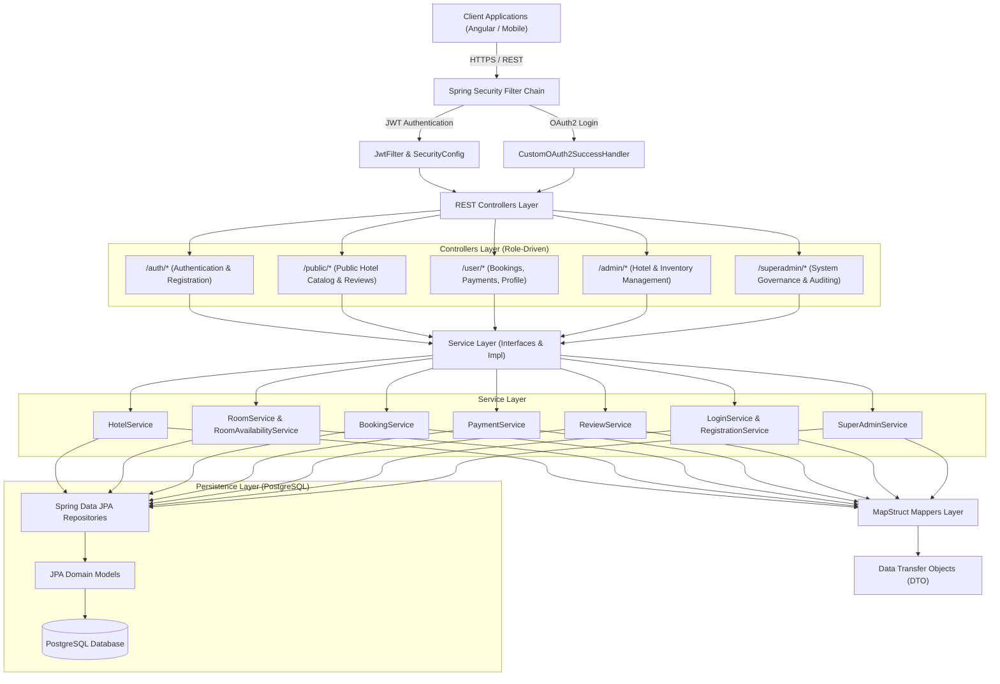

# GoReser Backend Architecture Documentation

## 1. System Overview
**GoReser** is an enterprise-grade Hotel Management and Reservation Platform developed using **Java 21**, **Spring Boot 3**, and **PostgreSQL**. The backend is architected following domain-driven, layered (N-Tier) principles with clear separation of concerns, stateless security (JWT & Google OAuth2), and decoupled data transfer models.

---

## 2. Package & Layer Structure

### `config/`
Provides configuration beans for OpenAPI/Swagger documentation (`SwaggerConfig`), Cross-Origin Resource Sharing (`WebConfig`), OAuth2 authentication (`OAuth2Config`), and default database seeding (`DataInitializer`).

### `controllers/`
Organized strictly by client audience and security privilege:
- `auth/`: Authentication, Registration, and Google OAuth2 endpoints.
- `publicapi/`: Unauthenticated public endpoints for discovering hotels and browsing guest reviews.
- `user/`: Authenticated operations for customers (creating bookings, payment submissions, reviews, updating profile).
- `admin/`: Hotel administration, room category configurations, individual rooms, inventory, reviews, and bookings.
- `superadmin/`: Global system management across all hotels, system-wide analytics, and administrative user controls.

### `dto/`
Domain-specific Data Transfer Objects preventing direct entity exposure to API clients:
- `auth/`, `hotel/`, `room/`, `booking/`, `payment/`, `review/`, `user/`.

### `enums/`
Type-safe domain enumerations:
- `BookingStatus` (`PENDING`, `CONFIRMED`, `CANCELLED`, `COMPLETED`).
- `PaymentStatus` (`PENDING`, `COMPLETED`, `FAILED`, `REFUNDED`).
- `UserRole` (`ROLE_USER`, `ROLE_ADMIN`, `ROLE_SUPERADMIN`).

### `exceptions/`
Centralized error handling and standardized error responses:
- `GlobalExceptionHandler`: Intercepts validation failures, resource not found exceptions, and security violations.
- `ErrorResponse`: Uniform JSON response model.

### `mapper/`
High-performance MapStruct mappers performing bi-directional conversions between JPA Entities and DTOs.

### `models/`
JPA Entities representing relational database tables in PostgreSQL:
- `hotel/`: `Hotel`, `City`, `State`.
- `room/`: `Room`, `RoomCategory`, `RoomImage`.
- `booking/`: `Booking`.
- `payment/`: `Payment`.
- `review/`: `Review`.
- `user/`: `User`, `Role`.

### `repo/`
Spring Data JPA repositories providing CRUD and specialized JPQL / Criteria queries.

### `security/`
JWT token generation, validation, and Spring Security filters:
- `JwtUtil`: Token encoding and signature verification.
- `JwtFilter`: Header token extraction and authentication context population.
- `SecurityConfig`: Role-based route authorization.

### `services/`
Strictly decoupled business logic layer:
- `interfaces/`: Public contracts for business services.
- `impl/`: Transactional business logic implementations.

### `specification/`
Dynamic query filtering using JPA Criteria API (`HotelSpecification`, `BookingSpecification`).

### `validation/`
Custom Bean Validation annotations (`@ValidPassword`, `PasswordValidator`).
